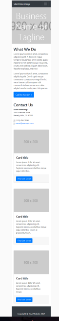

#Reto de código - 2. MI PÁGINA
En este reto, vamos a realizar una página a nuestro gusto.

El diseño lo puedes realizar como mejor te parezca, pero debes mantener la estructura de la página y debes realizarlo con un grid (cualquiera pero que no sea un framework como Bootstrap o Materialize). La estructura de la página es la siguiente:

Este reto se creo una pagina responsive en 300 y 480 con un cambio a un menu desplegable en estos pixeles, el mayor reto fue acomodar cada parte de la página para un tamaño en exacto, crear una estructura html muy bien definida fue el primer reto que al concluir se comenzo com los estilos en css para lograr que se respetara el tamaño en 300 y 480 se utilizaron medias, para el menu desplegable se agrego un evento en js.
se utilizo un grid.
